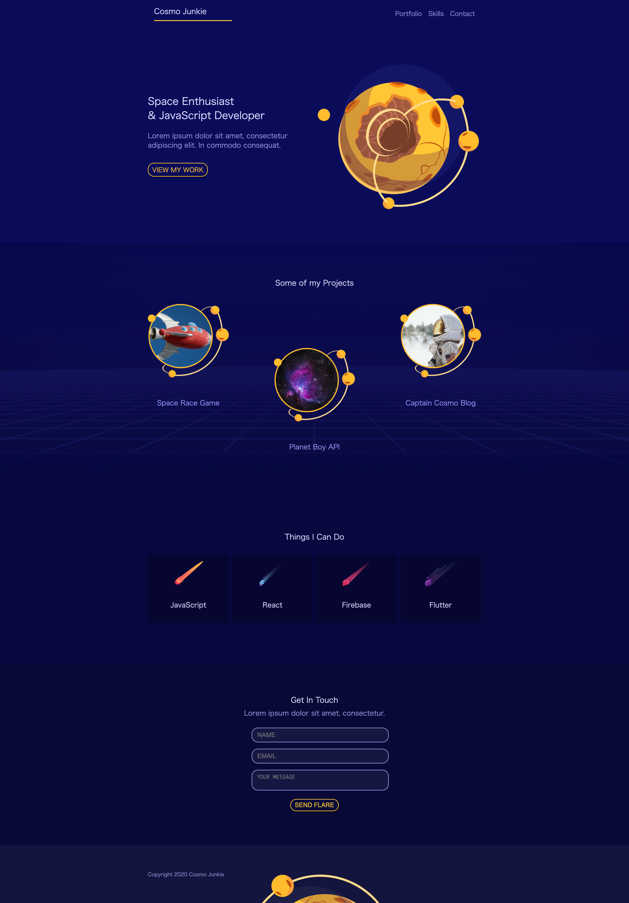
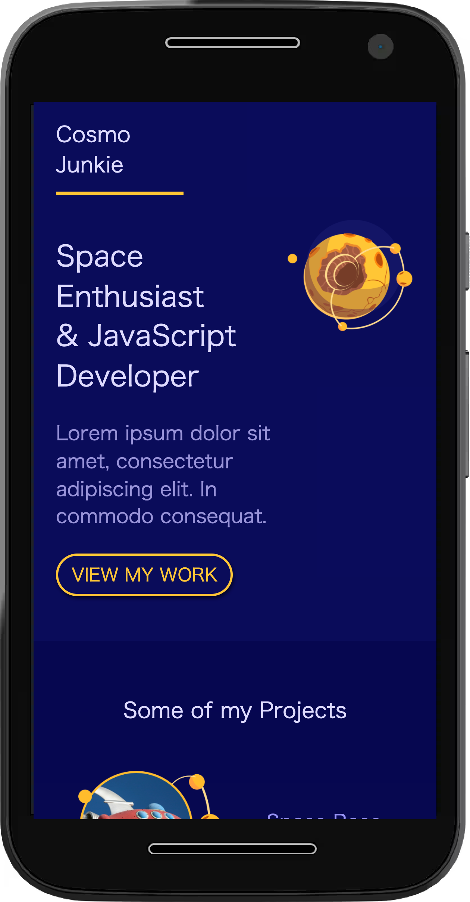

# CSS-Grid-MobileFirst

## ScreenShot of the project (Desktop)

## ScreenShot of the project (Mobile)

## Detail of the project

The Project is CSS Grid course in Youtube.

https://www.youtube.com/watch?v=PM3XW_1RAIs

## Purpose of the project

Learn to CSS Grid Fundamentals and Mobile First Approach.

## Demo

https://hiros-dev.github.io/CSS-Grid-MobileFirst/

## What did I learn from this project?

How to use CSS Grid

Mobile first approach

Thank you for reading. And, happy coding!!!
